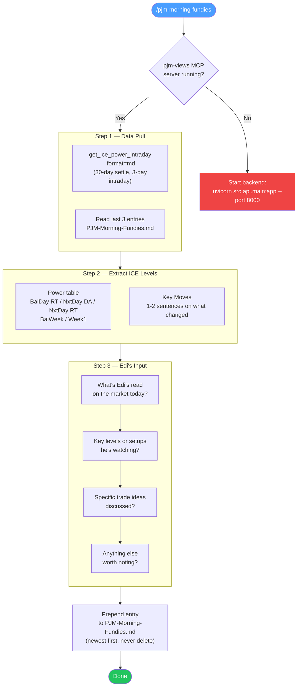

# PJM Daily Morning Fundies — Claude Code Prompt

## How to Run

Invoke with `/pjm-morning-fundies` in Claude Code.

## What It Does

Generates a daily entry in `PJM/PJM-Morning-Fundies.md` by:
1. Pulling ICE short-term power levels from the `pjm-views` MCP server
2. Prompting for Edi's market read

See `.SKILLS/pjm-daily-fundies.md` for the full template and workflow.

## Workflow Diagram



## Prerequisites

The `pjm-views` MCP server must be running:
```bash
cd helioscta-pjm-da/backend
uvicorn src.api.main:app --port 8000
```

## Changelog

| Date | Change |
|------|--------|
| 2026-04-13 | **Simplified**: ICE power only (no gas) + Edi chat. Removed trade decision, iteration log, gas table. |
| 2026-04-13 | Format redesign: Stripped 18 SQL queries. ICE views + Edi notes + forced trade decision. |
| 2026-03-13 | Initial 18-query automated prompt with iteration log |
