# 03 — Workflow & Gap Analysis (Forward-Only KNN)

Agent 3 deliverable. Trace the data flow through the actual code, annotate
each node with its file + the config knobs that touch it, and call out gaps
that fall between Agent 1 (spec) and Agent 2 (audit) territory.

All file paths are repo-relative. Code citations are `file.py:line`.

---

## 1. Pipeline overview

```mermaid
flowchart TD
    subgraph DATA["Data Ingest (parquet cache)"]
        DA[("lmps_da<br/>pjm_lmps_hourly")]
        RTLOAD[("load_rt<br/>pjm_load_rt_hourly")]
        LFCST[("load_forecast<br/>pjm_load_forecast_hourly_da_cutoff")]
        MLFCST[("meteologica_load_forecast")]
        OUTACT[("outages_actual<br/>pjm_outages_actual_daily")]
        OUTFCST[("outages_forecast<br/>pjm_outages_forecast_daily")]
        SOLFCST[("solar_forecast<br/>pjm_solar_forecast_hourly_da_cutoff")]
        WINDFCST[("wind_forecast<br/>pjm_wind_forecast_hourly_da_cutoff")]
        MSOL[("meteologica_solar_forecast")]
        MWIND[("meteologica_wind_forecast")]
        NLACT[("net_load_actual<br/>pjm_net_load_rt_hourly")]
        NLFCST[("net_load_forecast<br/>pjm_net_load_forecast_hourly_da_cutoff")]
        MNLFCST[("meteologica_net_load_forecast")]
        GAS[("gas_prices_hourly<br/>ice_python_next_day_gas_hourly")]
        EACAP[("installed_capacity<br/>ea_pjm_installed_capacity_monthly")]
    end

    LOADER["common/data/loader.py<br/><i>_load_dataset + per-source<br/>_normalize_* fns</i>"]:::loader
    DA --> LOADER
    RTLOAD --> LOADER
    LFCST --> LOADER
    MLFCST --> LOADER
    OUTACT --> LOADER
    OUTFCST --> LOADER
    SOLFCST --> LOADER
    WINDFCST --> LOADER
    MSOL --> LOADER
    MWIND --> LOADER
    NLACT --> LOADER
    NLFCST --> LOADER
    MNLFCST --> LOADER
    GAS --> LOADER
    EACAP --> LOADER

    subgraph FEAT["Feature Engineering"]
        BPOOL["features/builder.py::build_pool<br/><i>realized features + lmp_h1..h24 labels</i>"]:::node
        BQUERY["features/builder.py::build_query_row<br/><i>forecast features for target_date</i>"]:::node
        CAL["common/calendar::compute_calendar_row<br/>+ _calendar_for_date"]:::node
    end

    LOADER -- "normalized hourly DFs" --> BPOOL
    LOADER -- "normalized hourly DFs" --> BQUERY
    CAL -- "is_weekend, dow_sin/cos,<br/>dow_group, is_nerc_holiday" --> BPOOL
    CAL --> BQUERY

    subgraph MODEL["Analog Selection"]
        PREF["validation/preflight.py::run_preflight<br/><i>per-group coverage check</i>"]:::node
        DERIV["pipelines/forecast.py::_derive_effective_weights<br/><i>zero out low-coverage groups</i>"]:::node
        FILT["similarity/filtering.py::apply_filter_ladder<br/><i>strict-to-relaxed DOW/holiday</i>"]:::node
        OREG["similarity/filtering.py::outage_regime_filter<br/><i>z-score band</i>"]:::node
        ENSURE["similarity/filtering.py::ensure_minimum_pool<br/><i>date-proximity backfill</i>"]:::node
        DIST["similarity/engine.py::_compute_distances<br/><i>NaN-aware z-score Euclidean</i>"]:::node
        REC["similarity/engine.py::find_twins<br/><i>(recency multiplier + sort+top-N)</i>"]:::node
        WTS["similarity/metrics.py::compute_analog_weights<br/><i>inverse-distance / softmax / rank / uniform</i>"]:::node
    end

    BPOOL -- "pool DataFrame<br/>(N_history rows × features + labels)" --> PREF
    BQUERY -- "query Series<br/>(1 row × same features)" --> PREF
    PREF -- "missing/low-pool groups" --> DERIV
    DERIV -- "effective_weights" --> FILT
    BPOOL -- "season-windowed pool" --> FILT
    FILT -- "calendar-filtered pool" --> OREG
    OREG --> ENSURE
    ENSURE -- "filtered pool" --> DIST
    BQUERY -- "query Series" --> DIST
    DIST -- "weighted_sum / weight_sum<br/>per-row distance vector" --> REC
    REC --> WTS
    WTS -- "top-N analogs<br/>+ rank/distance/weight/similarity" --> AGG

    subgraph FCST["Forecast Aggregation"]
        AGG["pipelines/forecast.py::_hourly_forecast_from_analogs<br/><i>weighted mean + weighted quantile</i>"]:::node
        BUILDOUT["pipelines/forecast.py::_build_output_table<br/><i>HE1..24 + OnPeak/OffPeak/Flat</i>"]:::node
    end

    AGG --> BUILDOUT

    subgraph EVAL["Experiments / Evaluation"]
        REG["experiments/registry.py::CONFIG_REGISTRY<br/><i>baseline, netload_3x, tight_system, ...</i>"]:::node
        SCORE["experiments/evaluate_configs.py::run_scoreboard<br/><i>per-config flat MAE / OnPk / OffPk</i>"]:::node
        CMP["experiments/compare_analog_selection.py<br/><i>Jaccard, rank churn, feature alignment</i>"]:::node
    end

    REG -- "ForwardOnlyKNNConfig factories" --> SCORE
    SCORE -- "calls run_forecast(config=cfg)" --> BPOOL
    REG --> CMP
    CMP --> BPOOL
    BUILDOUT -- "Actual/Forecast/Error rows" --> SCORE
    BUILDOUT -- "scoreboard CSV<br/>logs/forward_only_knn_config_scoreboard.csv" --> OUT[(scoreboard CSV)]

    classDef loader fill:#ddeeff,stroke:#3366aa
    classDef node fill:#fef6dd,stroke:#aa8833
```

The diagram is read top-to-bottom: parquet sources → loader → feature
builders (pool + query) → preflight/effective-weight derivation → filter
ladder → outage regime → distance/recency/sort → top-N → weighted hourly
forecast → output table → optional experiments.

---

## 2. Node annotations

| Node | File path | Key functions | Config knobs that affect it | Notes |
|------|-----------|---------------|----------------------------|-------|
| Parquet loader | `modelling/da_models/common/data/loader.py` | `_load_dataset:836`, per-source `_normalize_*` (e.g. `_normalize_lmps_da:189`, `_normalize_meteologica_regional:585`, `_normalize_net_load_actual:644`, `_normalize_installed_capacity:717`) | `CACHE_DIR` env via `da_models/common/configs.CACHE_DIR`; pattern fallback list `_DEFAULT_PATTERNS:12` | First match wins from `_existing_candidates:135`. `_apply_column_filter:182` is the only column projection. Meteologica normalizer drops all but `forecast_rank`-max row per (region, date, hour) at `loader.py:619`. |
| Pool builder | `modelling/da_models/forward_only_knn/features/builder.py` | `build_pool:560`, `_build_load_features_pool:156`, `_build_net_load_features_pool:170`, `_build_outage_features_pool:268`, `_build_renewable_features_pool:319`, `_build_gas_features:410`, `_build_lmp_labels:435`, `_compute_reserve_margin_pct:534` | `configs.SCHEMA`, `configs.HUB`, `configs.CACHE_DIR`, `configs.LOAD_REGIONS`, `configs.FEATURE_GROUPS` (column whitelist via `_ensure_columns:463`) | Always emits the *full* feature column set so weights can be flipped without rebuilding. Pre-2019-04-02 solar/net-load is intentionally NaN. The `_safe_load:499` swallows loader errors as a `WARN`. |
| Query builder | `modelling/da_models/forward_only_knn/features/builder.py` | `build_query_row:637`, `_build_load_features_query:207`, `_build_net_load_features_query:239`, `_build_outage_features_query:291`, `_build_renewable_features_query:356` | `include_gas`, `include_outages`, `include_renewables`, `include_net_load` (passed in by `run_forecast`), plus the same `LOAD_REGIONS`/`FEATURE_GROUPS` as the pool | RTO uses PJM forecasts; MIDATL/WEST/SOUTH use Meteologica. Falls back to RT load when the forecast feed is missing for a region (`builder.py:221`). |
| Calendar features | `modelling/da_models/forward_only_knn/features/builder.py` (`_calendar_for_date:484`) + `modelling/da_models/common/calendar.compute_calendar_row` | `_calendar_for_date:484`, `_dow_group_from_num:477` | `configs.DOW_GROUPS:42` | Sun=0..Sat=6 convention, hardcoded. `is_nerc_holiday` flows from `compute_calendar_row` (not in this package). |
| Preflight | `modelling/da_models/forward_only_knn/validation/preflight.py` | `run_preflight:78`, `_group_coverage:46`, `_pool_group_coverage:59` | `min_pool_size` (= `configs.MIN_POOL_SIZE`), hardcoded `min_group_coverage=0.5`, `min_pool_group_coverage=0.1` (preflight.py:84-85) | Returns a report; never raises. |
| Effective-weight derivation | `modelling/da_models/forward_only_knn/pipelines/forecast.py` | `_derive_effective_weights:176` | `feature_weights` from caller; preflight `missing_query_groups` + `low_pool_groups` | Will force `calendar_dow >= 1.0` if every group gets disabled (forecast.py:188-191) — a silent fallback worth reading for anyone debugging "why are my weights different." |
| Calendar filter ladder | `modelling/da_models/forward_only_knn/similarity/filtering.py` | `apply_filter_ladder:36` | `same_dow_group` (`FILTER_SAME_DOW_GROUP`), `exclude_holidays` (`FILTER_EXCLUDE_HOLIDAYS`), `min_pool_size` | Stages: `exact_dow+holiday → exact_dow → dow_group+holiday → dow_group → no_calendar_filter`. Mismatch with the spec ladder: spec example (forward_only_knn.md:39-40) names `same DOW+holiday → same DOW → DOW group → no DOW hard filter` — close but not identical. |
| Season-window filter | `modelling/da_models/forward_only_knn/similarity/engine.py` | `_circular_day_distance:43`, `find_twins:112-121` | `season_window_days` (= `FILTER_SEASON_WINDOW_DAYS=60`); 366-day wraparound is hardcoded (engine.py:46) | Applied *before* the calendar ladder. Day-type profiles override window: weekend=45, sunday=60. |
| Outage regime filter | `modelling/da_models/forward_only_knn/similarity/filtering.py` | `outage_regime_filter:83` | `apply_outage_regime_filter` (`FILTER_OUTAGE_REGIME=True`), `outage_tolerance_std` (`FILTER_OUTAGE_TOLERANCE_STD=1.5`), `outage_filter_col` (`FILTER_OUTAGE_COL="outage_total_mw"`) | Skips silently when target outage is NaN or pool std is 0 (filtering.py:113-127). |
| Min-pool fallback | `modelling/da_models/forward_only_knn/similarity/filtering.py` | `ensure_minimum_pool:141` | `min_pool_size` | Date-proximity backfill — pulls *all* pre-target rows and ranks by `\|date - target\|`, ignoring DOW/holiday. Behavior gap noted below. |
| Distance computation | `modelling/da_models/forward_only_knn/similarity/engine.py` | `_compute_distances:49`, `_resolved_groups:26`, plus `metrics.fit_pool_zscore:21`, `metrics.apply_zscore:41`, `metrics.nan_aware_euclidean:7` | `feature_weights` (effective), `configs.FEATURE_GROUPS` | Per-group weighted Euclidean over z-scored values. NaN dimensions are dropped per pair, not imputed. Weighted average across groups uses `weight_sum` so groups with all-NaN candidates effectively shrink the denominator. |
| Recency penalty | `modelling/da_models/forward_only_knn/similarity/engine.py` | `find_twins:187-190` | `recency_half_life_days` (= `RECENCY_HALF_LIFE_DAYS=730`) | Multiplier `1 + age_days / half_life` — *not* an exponential decay despite the name. See undocumented-assumption note. |
| Top-N + analog weights | `modelling/da_models/forward_only_knn/similarity/engine.py` + `metrics.py` | `find_twins:199-214`, `metrics.compute_analog_weights:46` | `n_analogs` (`DEFAULT_N_ANALOGS=20`), `weight_method` (`"inverse_distance"` default) | Stable sort on `(distance, date)` (engine.py:199). Methods: `inverse_distance`, `softmax`, `rank`, `uniform` (metrics.py:55-65). |
| Hourly aggregation | `modelling/da_models/forward_only_knn/pipelines/forecast.py` | `_hourly_forecast_from_analogs:195`, `weighted_quantile:83` | `quantiles` (`QUANTILES=[0.10,0.25,0.50,0.75,0.90]`), `HOURS=[1..24]` | Per-hour weight renormalization after dropping NaN labels for that hour. |
| Output table | `modelling/da_models/forward_only_knn/pipelines/forecast.py` | `_build_output_table:115`, `_add_summary_cols:100`, `_actuals_from_pool:145` | `ONPEAK_HOURS=8..23`, `OFFPEAK_HOURS=1..7+24` | Hardcoded peak split — does **not** read from a config or NERC holiday calendar. |
| Day-type profiles | `modelling/da_models/forward_only_knn/configs.py` | `DAY_TYPE_PROFILES:147`, `with_day_type_overrides:268`, `_dow_key_for:185` | `use_day_type_profiles=True`, `day_type_profiles` overrides | Applied at run time inside `run_forecast` (forecast.py:1129). Profiles can override `feature_group_weights`, `n_analogs`, `season_window_days`, `same_dow_group`, `recency_half_life_days`. |
| Horizon gating | `modelling/da_models/forward_only_knn/pipelines/forecast.py` | `run_forecast:1131-1141` | `gas_feature_max_horizon_days=1`, `outage_feature_max_horizon_days=7`, `renewable_feature_max_horizon_days=7`, `net_load_feature_max_horizon_days=7` | Computed from `(target_date - date.today()).days`, clamped to ≥1. Drives `include_*` flags into `build_query_row` and `resolved_feature_weights`. |
| Reserve-margin feature | `modelling/da_models/forward_only_knn/features/builder.py` | `_compute_reserve_margin_pct:534`, `_ea_capacity_by_month:515`, `_month_start:507` | Group `target_reserve` weight (default 0.0; bumped to 3.0 by `with_reserve_margin` registry config) | Forward-style scarcity: `(installed - outage - peak_load) / peak_load`. Pool uses realized peak/outage; query uses forecast peak/outage. Capacity is monthly-keyed. |
| Experiment registry | `modelling/da_models/forward_only_knn/experiments/registry.py` | `CONFIG_REGISTRY:84`, `_baseline:33`, `_netload_3x:37`, `_tight_system:53`, `_outage_regime_off:64`, `_with_reserve_margin:72` | All `feature_group_weights` overrides; `apply_outage_regime_filter` toggled in `_outage_regime_off` | `BASELINE_WEIGHTS:16` is a *frozen copy* of `configs.FEATURE_GROUP_WEIGHTS` — drift between the two is a real risk (also see scoreboard's `config_hash` drift detector at `evaluate_configs.py:373`). |
| Scoreboard runner | `modelling/da_models/forward_only_knn/experiments/evaluate_configs.py` | `run_scoreboard:284`, `_score_one:106`, `_config_fingerprint:86`, `render_summary:340` | All registry configs; `--baseline`, `--configs`, `--date`, `--summary` CLI args | CSV append at `_append_rows:195` is **commented out** — `run_scoreboard:300-301`. Currently console-only. |
| Analog-selection diff | `modelling/da_models/forward_only_knn/experiments/compare_analog_selection.py` | `main:269`, `_print_per_date:132`, `_feature_for_analogs:87` | Two registry configs (`--configs`), `--feature` (default `reserve_margin_pct`), `--top-n` (default 10) | Standalone diagnostic, not wired into the scoreboard. |

---

## 3. Data lineage trace — top 5 features

The "top 5" here means: groups with the highest baseline weight in
`FEATURE_GROUP_WEIGHTS` (configs.py:102), not weights from a fitted model.

### 1. `load_daily_peak_rto` (group `load_level`, weight 3.0)

- **Origin (pool):** `pjm_load_rt_hourly` parquet → `loader.load_load_rt:884` → `_normalize_load_rt:227` (rename `rt_load_mw`, drop nulls) → `build_pool:574` → `_build_load_features_pool:156` → `_per_region_daily_aggregates:94` → `_load_daily_aggregates:35` daily `max(rt_load_mw)`.
- **Origin (query):** `pjm_load_forecast_hourly_da_cutoff` for RTO via `loader.load_load_forecast:893` → `_normalize_load_forecast:258` → `_build_load_features_query:207` → same `_load_daily_aggregates:35` aggregation. Other regions sourced from Meteologica; falls back to realized RT load when forecast missing (builder.py:221).
- **Transformations:** filter to `region == "RTO"` (builder.py:108); group by `date` and aggregate `max`/`min`/`mean` (builder.py:60-69); merge HE5/8/15/20 for ramps (builder.py:80-91); rename to `_rto` suffix (builder.py:118-119).
- **First used:** `find_twins → _compute_distances → fit_pool_zscore` (engine.py:68); also feeds `_compute_reserve_margin_pct:534` as the peak-load denominator.
- **Timestamp handling:** `pd.to_datetime(...).dt.date` everywhere (builder.py:49); no explicit timezone — relies on the parquet being in EPT already (loader.py uses raw `date` columns; weather normalizer reads `date_ept` but load does not — see gap below).

### 2. `gas_m3_daily_avg` (group `gas_level`, weight 2.0)

- **Origin (both pool and query):** `ice_python_next_day_gas_hourly` parquet → `loader.load_gas_prices_hourly:1021` → `_normalize_gas_prices_hourly:528` (renames `tetco_m3_cash → gas_m3` etc., aggregates duplicates by `(date, hour_ending)` mean at line 581) → `build_pool:575` → `_build_gas_features:410`.
- **Transformations:** for each available hub, `groupby("date").agg(mean)` (builder.py:430-431). No price filter, no holiday adjustment.
- **First used:** distance computation as the only member of `gas_level` group on `gas_m3_daily_avg`. **Note:** this group has 4 columns (`gas_m3, gas_tco, gas_tz6, gas_dom_south`) all `_daily_avg` — it is *not* per-region.
- **Timestamp handling:** `gas_day` accepted as fallback date column (loader.py:531) but no business-day shifting — Friday gas covers Sat/Sun is **not** modeled.

### 3. `outage_total_mw` (group `outage_level`, weight 2.0)

- **Origin (pool):** `pjm_outages_actual_daily` → `loader.load_outages_actual:911` → `_normalize_outages_actual:329` → `build_pool:576` → `_build_outage_features_pool:268`. Filtered to `region == LOAD_REGION` (= `"RTO"`, builder.py:274).
- **Origin (query):** `pjm_outages_forecast_daily` → `_build_outage_features_query:291`. Picks the **most recent** `forecast_execution_date` for the target date (builder.py:305-307) — implicit "latest forecast" assumption.
- **Transformations:** `outage_forced_share = forced / total` with zero→NaN protection (builder.py:287). Single-region scalar.
- **First used:** distance group `outage_level` (configs.py:72-76) **and** the `outage_regime_filter` (engine.py:148, filtering.py:83). It enters the pipeline twice: once as a feature, once as a hard filter. This double-use is undocumented in the spec.
- **Timestamp handling:** `forecast_execution_date` is coerced via `_coerce_date` (loader.py:395); no time-of-day component preserved.

### 4. `net_load_daily_peak_rto` (group `net_load`, weight 2.0)

- **Origin (pool):** `pjm_net_load_rt_hourly` → `loader.load_net_load_actuals:956` → `_normalize_net_load_actual:644` (preserves NaNs from pre-2019-04-02, see loader.py:649) → `build_pool:577` → `_build_net_load_features_pool:170` → `_per_region_daily_aggregates:94`.
- **Origin (query):** `pjm_net_load_forecast_hourly_da_cutoff` for RTO; Meteologica regional for MIDATL/WEST/SOUTH → `_build_net_load_features_query:239`. Note: net-load forecast normalizer reuses the meteologica normalizer (loader.py:828-829).
- **Transformations:** identical aggregation pipeline as `load_*` but on `net_load_mw`. Pre-2019-04-02 rows are intentionally NaN-emitting (builder.py:175-178).
- **First used:** distance computation `net_load` group; not used in any filter.
- **Timestamp handling:** same as load.

### 5. `solar_daily_avg_rto` (group `renewable_level`, weight 1.5)

- **Origin (pool):** `pjm_net_load_rt_hourly` provides per-region `solar_gen_mw` and `wind_gen_mw` columns → `_build_renewable_features_pool:319` → `_per_region_daily_avg:125` (one mean per `(region, date)`).
- **Origin (query):** `pjm_solar_forecast_hourly_da_cutoff` (system-wide, no region column — note `df_pjm_has_no_region=True` at forecast.py:539) and `pjm_wind_forecast_hourly_da_cutoff`. Meteologica feeds for non-RTO regions.
- **Transformations:** daily mean of hourly MW; combined `renewable_mw = solar + wind` (builder.py:337-338).
- **First used:** `renewable_level` group in `_compute_distances`. Pre-2019-04-02 solar is NaN, propagated through `renewable_mw`.
- **Timestamp handling:** `forecast_date` accepted as the date column for forecasts (loader.py:417); no UTC↔EPT conversion in either side. **Implicit: both pool and query are EPT.**

---

## 4. Concrete gaps

### Missing features (spec → code)
- **Weather features absent.** Spec calls out `weather_level` and `weather_hdd_cdd` (forward_only_knn.md:94) and lists weather as MVP-priority. `FEATURE_GROUPS` has no weather entries (configs.py:55-100); `loader.py:994-1018` exposes `load_weather_*` but nothing in `forward_only_knn/` calls them. Grep across the package confirms zero references (only `temperature` arg on softmax). Major spec/code drift.
- **`strip_forecast.py` not implemented.** Spec mandates `pipelines/strip_forecast.py` with `run_strip_forecast(horizon=N)` (forward_only_knn.md:135-141, MVP acceptance check #2). No file or function exists — `pipelines/` only has `forecast.py` and `__init__.py`.

### Untested configs (knob defined but no registry coverage)
- **`weight_method`** (configs.py:209) — supports `softmax`/`rank`/`uniform`/`inverse_distance` (metrics.py:55-65) but every entry in `CONFIG_REGISTRY` (registry.py:84) leaves it at the default. `softmax`'s `temperature` parameter (metrics.py:49) is never exposed up the call chain.
- **`recency_half_life_days`** (configs.py:129) — single value (730d). No registry config flips it; only weekend/sunday day-type profiles override implicitly via weights.
- **`apply_outage_regime_filter` toggle** is partially tested — `_outage_regime_off` (registry.py:64) flips it, but `outage_tolerance_std` is never swept.
- **`exclude_holidays`** (configs.py:118) and **`min_pool_size`** (configs.py:35) — never overridden by any registry entry.
- **Day-type profile overrides** (configs.py:147-170) — `use_day_type_profiles=True` by default, applied unconditionally for weekend dates. No registry config exists with `use_day_type_profiles=False` to A/B the override.

### Undocumented assumptions / hardcoded constants
- **Recency multiplier is linear, not half-life.** Variable named `recency_half_life_days` but engine.py:189 computes `1 + age_days / half_life`. A 730-day-old day gets multiplier ≈2.0; a 1460-day-old day gets ≈3.0. This is **not** an exponential half-life. Either the name or the formula is wrong; spec doesn't specify (forward_only_knn.md:114 just says "optional recency penalty").
- **OnPeak/OffPeak hour split is hardcoded.** `forecast.py:50-51` defines `ONPEAK_HOURS = list(range(8, 24))` and `OFFPEAK_HOURS = list(range(1, 8)) + [24]`. NERC convention (HE08-HE23 weekdays only) is *not* applied — weekend forecasts still split on the same hours. No config knob.
- **`circular day-of-year` is 366-day, leap-year-agnostic.** `_circular_day_distance:43` uses `np.minimum(direct, 366.0 - direct)`. Most years have 365 DOYs, so wraparound is off-by-one for non-leap dates. Minor but undocumented.
- **Calendar convention Sun=0..Sat=6.** Configs and builder use `(weekday + 1) % 7` (configs.py:187, builder.py:487). Standard Python is Mon=0..Sun=6, and ISO is Mon=1..Sun=7. Anyone reading raw `day_of_week_number` values in the pool will be confused.
- **No timezone handling.** Loader's `_coerce_date` is a naive `pd.to_datetime(...).dt.date` (loader.py:175). Pool and query both assume EPT. The weather normalizer alone reads `date_ept` (loader.py:476); load/LMP/gas all read raw `date`. If any upstream parquet ever lands in UTC, the join silently misaligns by an hour.
- **`_safe_load` swallows all loader exceptions.** Optional feeds become silent NaNs (builder.py:499-504). Combined with the silent-skip behavior in `_compute_distances` for all-NaN groups, a missing parquet manifests as "low coverage" rather than a hard error.
- **Min-pool fallback ignores DOW/holiday matching.** `ensure_minimum_pool:141` ranks by date proximity only — if outage filtering plus calendar filtering both run out of room, you can end up matching weekdays to Sundays. Spec ladder (forward_only_knn.md:39-40) does not describe this fallback.

### Dead code / TODO leftovers
- **`build_pool` ignores most of its kwargs.** `cache_enabled`, `cache_ttl_hours`, `force_refresh`, and `schema` (after the log line) are unpacked into `_ = (...)` at builder.py:569. The cache plumbing in the docstring is decorative.
- **`build_query_row` likewise discards `schema`, `include_gas`, and cache flags** at builder.py:650.
- **Scoreboard CSV write is commented out.** `evaluate_configs.py:300-301` says `# CSV scoreboard disabled for now` so `--summary` will only see legacy rows. The render code path (`render_summary:340`) still works against historical CSV but new runs don't append.
- **`forecast.py:1337-1338`** has a commented-out `target_date = datetime.now().date()` block in `__main__`. Trivial but clutters the entrypoint.
- **`find_analogs` wrapper** (engine.py:229-258) is "backward-compatible" but has no callers in this package after the refactor — only `find_twins` is invoked. Dead until something external imports it.
- **`gas_feature_max_horizon_days = 1`** with no registry test of `D+2` runs proves `include_gas=False` path actually works as intended.

### Plumbing gaps (config exists, code path doesn't honor it)
- **`day_type_profiles` field is a config knob (configs.py:218)** but `with_day_type_overrides:268` only consults `resolved_day_type_profiles()`, which falls back to the module-level `DAY_TYPE_PROFILES`. Passing a custom dict at construction time *does* work (configs.py:259-266) — but no registry config does so, so this is "wired but never tested."
- **`schema` field is a config knob** (configs.py:210, default `pjm_cleaned`) but the loader is parquet-only and never queries Postgres. `schema` only shows up as a header in `_print_config:1015` and in the scoreboard fingerprint.
- **`forecast_date` field on the config** (configs.py:199) flows through `resolved_target_date:225`, but `run_forecast` accepts its own `target_date` kwarg and only falls back to `config.resolved_target_date()` when the kwarg is `None` (forecast.py:1124). Two ways to set the same thing — works, but easy to confuse in scripts.
- **Quantile rendering inserts `Forecast` row mid-table** at forecast.py:1291-1297. `Forecast` already exists in the main `output_table`. Duplicate rows in `quantiles_table` are likely intended (P50 visual marker) but not documented.

---

## 5. Loose ends (heads-up to the synthesis agent)

- **For Agent 1 (literature):** the spec's "Phase 2" (forward_only_knn.md:190-195) lists outages and renewables as deferred, but they are already in `FEATURE_GROUPS` and exercised in registry configs. The spec is out of date relative to what shipped.
- **For Agent 2 (audit):** the `_compute_distances` group-aggregation formula (engine.py:80-81) divides by `weight_sum` but `weight_sum` accumulates per-row across groups, so a candidate with zero overlap on a high-weight group still gets a finite distance from the lower-weight groups. This may or may not be intended behavior — worth flagging in the audit. Also: outage features feed the distance metric *and* a hard filter, which double-counts that signal.
- **For Agent 1 + Agent 2:** the `Like-Day` paper Lora et al. 2007 (referenced in `pjm-like-day-research.md:43-51`) recommends `weight_method` tuning by GA. Current code has the `weight_method` parameter, but it is never tuned anywhere in `forward_only_knn/`. The four implementations (inverse_distance/softmax/rank/uniform) sit unused.
- **For dbt/data sources team (per memory):** the `pjm_day_gen_capacity_daily` mart was deleted (git status shows `D backend/dbt/.../pjm_day_gen_capacity_daily.sql`). `loader.py:979-991` still has a `load_day_gen_capacity` function and the `_DEFAULT_PATTERNS` entry — orphaned now.
